# Rapport – TP1 MLOps :
  ## Docker, FastAPI, PostgreSQL & Docker Compose

### OUALGHAZI mohamed

#### Execice 1 : installation de Docker et vérification de l'environement 

Après installation de Docker Desktop et exécution :

docker run hello-world

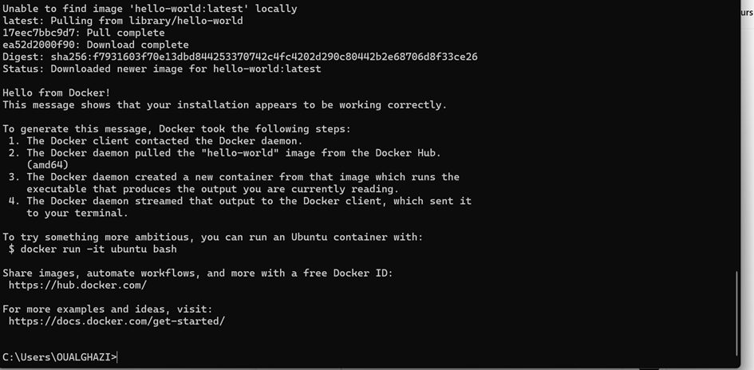  
Docker a correctement lancé un conteneur test.

La commande :

docker ps -a
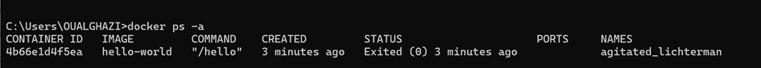  

affiche tous les conteneurs, y compris ceux arrêtés.
#### Exercice 2: Premiers pas avec Docker : images et coteneurs

Images vs Conteneurs Docker  
Différence entre image et conteneur  
Une image Docker est un modèle figé contenant un système de fichiers, des programmes, des librairies et une configuration prête à l’emploi.  
Un conteneur Docker est une instance en exécution d’une image.
→ L'image est le plan, le conteneur est le processus actif.

Manipulations simples avec Alpine
Commande exécutée :  
docker run alpine echo "Bonjour depuis un conteneur Alpine"

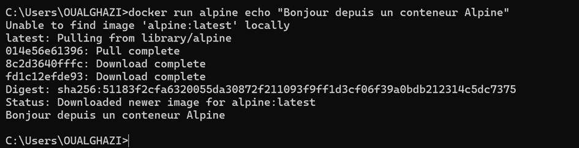  
Après l’exécution de la commande, Docker crée un conteneur basé sur l’image Alpine, exécute la commande echo qui affiche le message dans le terminal, puis le conteneur s’arrête automatiquement car le programme est terminé. Le conteneur ne reste pas actif.

La commande :

docker ps -a

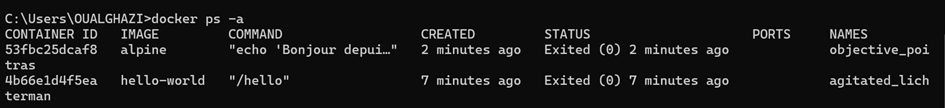  

Le conteneur Alpine apparaît avec le statut Exited (0), ce qui signifie que le programme qu’il exécutait s’est terminé normalement. Comme la commande echo s’est finie immédiatement, le conteneur s’est arrêté automatiquement après l’affichage du message.

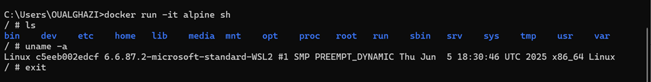  
En mode interactif, le conteneur permet d’utiliser un terminal.  
La commande ls affiche le contenu du système de fichiers minimal du conteneur.  
La commande uname -a montre que le conteneur s’exécute sous un noyau Linux.  
La commande exit ferme le terminal, ce qui stoppe immédiatement le conteneur.  
#### Exercice 3:
##### Etape 1:  

Fichier app.py:  
from fastapi import FastAPI

app = FastAPI()

@app.get("/health")  
def health():  
    return {"status": "ok"}  

##### Etape 2: Dockerfile  
FROM python:3.11-slim  
WORKDIR /app  
COPY app.py /app/  
RUN pip install fastapi uvicorn  
CMD ["uvicorn", "app:app", "--host", "0.0.0.0", "--port", "8000"]  

##### Etape 3 : Construire l'image  

docker build -t simple-api .

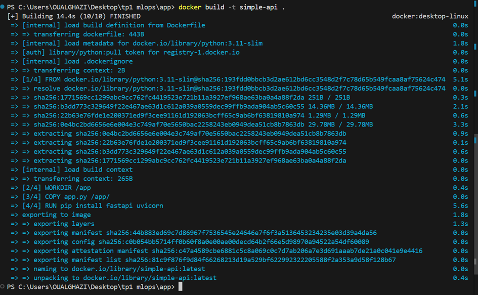  

#### Exercice 4: Executer l'API FastAPI dans un conteneur Docker

##### Etape 1: Lancement
docker run -p 8000:8000 simple-api

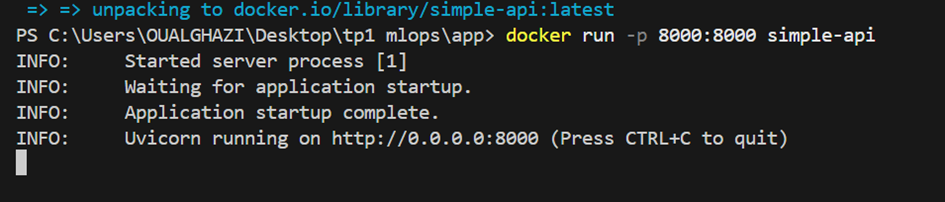  

L’option -p 8000:8000 sert à faire un mapping de ports entre la machine hôte et le conteneur.
Le premier 8000 correspond au port de la machine hôte (localhost), et le second 8000 au port exposé dans le conteneur.
Grâce à ce mapping, lorsque j’accède à http://localhost:8000 depuis mon navigateur, la requête est redirigée vers l’API qui tourne dans le conteneur.
##### Etape 2 : Test
Réponse dans le navigateur : http://localhost:8000/health

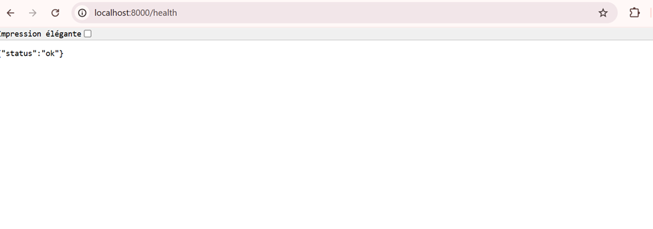   

##### Etape 3 : observation

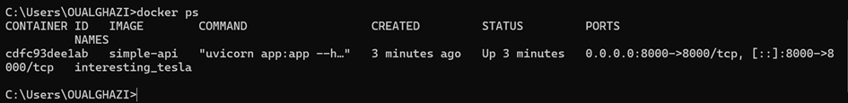  

docker ps montre que le conteneur basé sur l’image simple-api est en cours d’exécution.
On peut y lire :
•	Image utilisée : simple-api
•	Nom du conteneur : par exemple interesting_tesla
•	Ports mappés : 0.0.0.0:8000->8000/tcp, ce qui signifie que le port 8000 de la machine hôte est redirigé vers le port 8000 du conteneur.
##### Etape 4: 
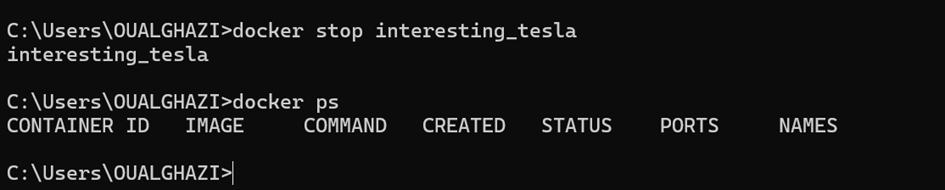  

#### Exercice 5: Demarer un mini-système 

##### Etape 1: Structure des dossiers

├── api/    
│   ├── app.py  
│   └── Dockerfile  
└── docker-compose.yml  

##### Etape 2: Fichier docker-compose.yml

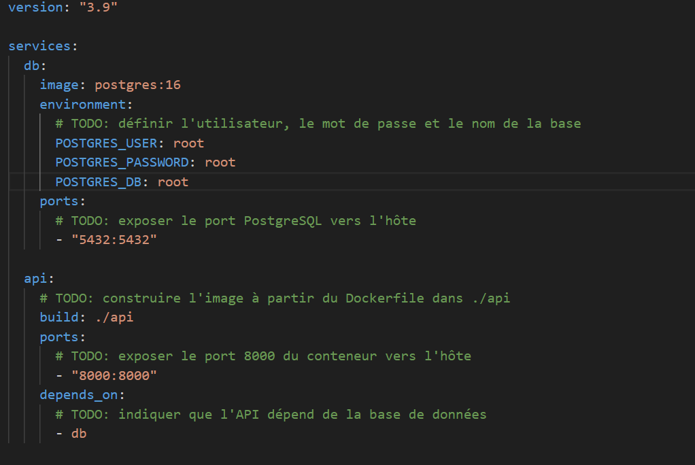  

##### Etape 3: 

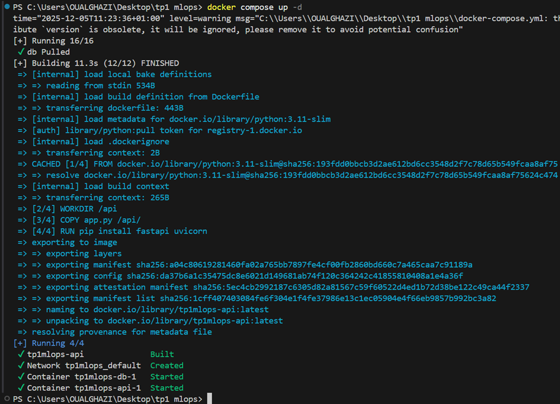  

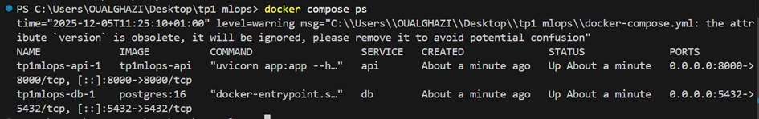  

##### Etape 4: Test 
curl http://localhost:8000/health

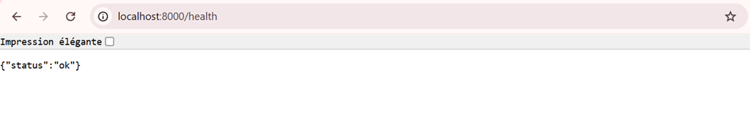  

##### Etape 5: Arrêter les services
 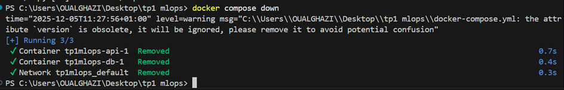  

 La commande « docker compose down » 
arrête et supprime tous les conteneurs créés par le fichier docker-compose.yml (ainsi que le réseau associé).  
A l’inverse, la commande « docker stop <id_du_conteneur> » ne fait qu’arrêter un seul conteneur individuel, sans le supprimer.  
 Le conteneur reste visible dans docker ps -a et peut être relancé ultérieurement avec docker start.  
#### Exercice 6: 
##### Etape 1:se connecter au conteneur Postgresql
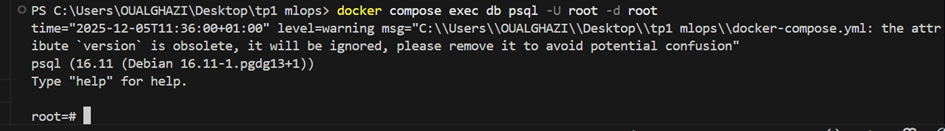  
•  docker compose exec : exécute une commande dans un conteneur géré par Docker Compose.
•  db : nom du service/contener défini dans docker-compose.yml pour PostgreSQL.
•  psql : client en ligne de commande de PostgreSQL.
•  -U demo : précise l’utilisateur PostgreSQL à utiliser (root).
•  -d demo : précise la base de données cible (root).

##### Etape 2:
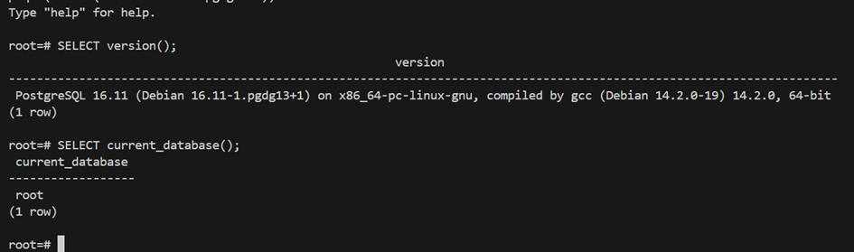  
##### Etape 3:
Dans l’architecture Docker Compose, un autre service (comme l’API FastAPI) peut se connecter à la base PostgreSQL en utilisant les informations suivantes :
•	Hostname : db (le nom du service défini dans docker-compose.yml, résolu automatiquement par Docker).
•	Port : 5432 (port PostgreSQL à l’intérieur du réseau Docker).
•	Utilisateur : root (variable POSTGRES_USER).
•	Mot de passe : root (variable POSTGRES_PASSWORD).
•	Base de données : root (variable POSTGRES_DB).

#### Execice 7: 
##### Etape 1:
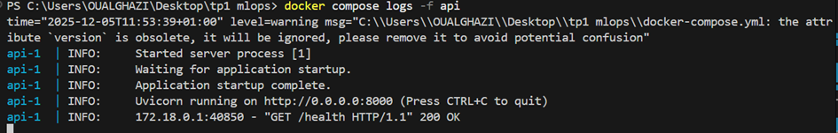  

*	Au démarrage de l’API, on voit les messages du serveur Uvicorn, par exemple le chargement de l’application, l’host et le port utilisés.
*	Lorsqu’une requête /health est reçue, une ligne de log supplémentaire apparaît, indiquant généralement la méthode HTTP, le chemin et le code de réponse
*	Ces logs permettent de vérifier que l’API démarre bien et que les requêtes sont effectivement reçues et traitées.

##### Etape 2:
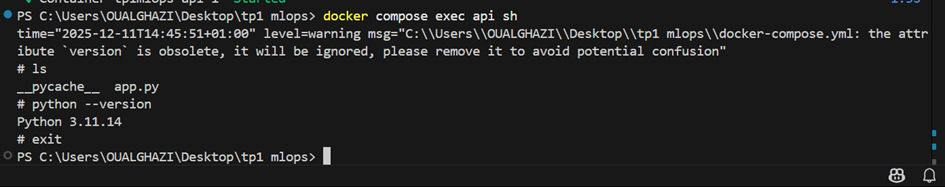  
La commande :
docker compose exec api sh
ouvre un shell sh dans le conteneur du service api.
À l’intérieur du conteneur :
*	ls affiche la liste des fichiers présents dans le système de fichiers du conteneur, par exemple le fichier app.py .
*	python --version affiche la version de Python installée dans l’image (par exemple Python 3.11.14), ce qui permet de vérifier l’environnement d’exécution réel de l’API.
*	exit permet de quitter le shell et de revenir au terminal de l’hôte.

##### Etape 3:
Un redémarrage peut être utile dans plusieurs situations :
*	après une mise à jour du code ou de la configuration de l’API ;
*	lorsqu’un service est bloqué ou ne répond plus correctement ;
*	pour appliquer certaines modifications d’environnement sans redémarrer toute la stack Docker Compose.

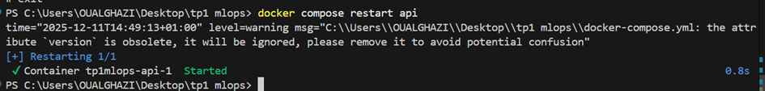  

##### Etape 4:

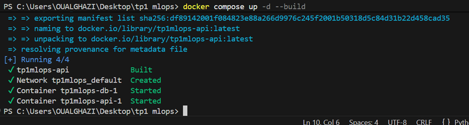  

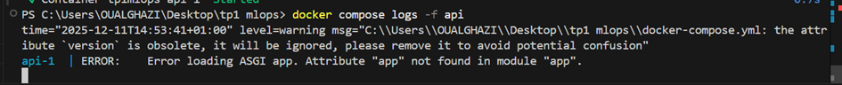  

Pour simuler un problème, j’ai volontairement introduit une erreur dans app.py en renommant l’objet FastAPI app en appi, alors que le serveur Uvicorn est lancé avec :
uvicorn app:app  
Après reconstruction de l’image (docker build -t simple-api .) et redémarrage de la stack avec :
docker compose up -d --build
le service api ne démarre plus correctement.  
En examinant les logs avec :  
docker compose logs -f api  
on observe un message d’erreur indiquant qu’Uvicorn n’arrive pas à trouver l’application app dans le module app.  
Ce message permet d’identifier la cause du problème : le nom de la variable d’application dans app.py ne correspond pas à celui attendu par Uvicorn (app).
En corrigeant le code pour revenir à :  
app = FastAPI()
puis en reconstruisant l’image et en relançant Docker Compose, le service démarre à nouveau normalement.

##### Etape 5:
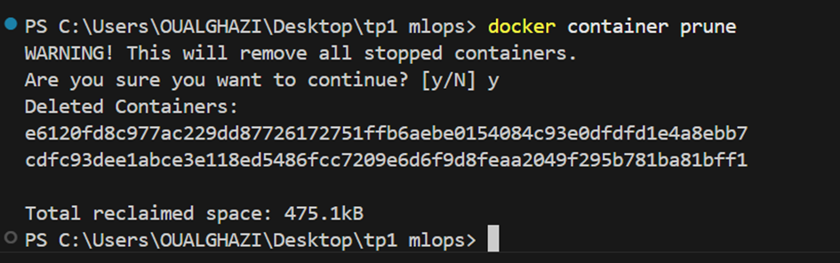  

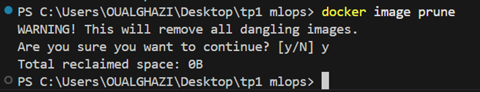  

Il est utile de nettoyer régulièrement son environnement Docker car :
*	les builds successifs créent beaucoup d’images intermédiaires ;
*	les conteneurs arrêtés et les images inutilisées occupent de l’espace disque ;
*	un environnement encombré peut rendre le diagnostic plus difficile (trop de conteneurs/images à lister).  
Ces commandes permettent donc de garder un environnement Docker plus propre, plus lisible et de limiter l’utilisation du stockage.

#### Exercice 8: 
##### 1. Question 8.a:
*	Il ne garantit pas la reproductibilité de l’environnement. Les dépendances, versions de bibliothèques, variables système et configurations peuvent varier d’une machine à l’autre, ce qui peut provoquer des comportements différents entre la phase de développement et la mise en production. À l’inverse, Docker permet de définir précisément l’environnement d’exécution dans une image unique reproductible sur n’importe quel système.  
*	Un notebook n’est pas conçu pour l’automatisation. Son exécution dépend souvent d’actions manuelles (lancement des cellules, ordre d’exécution), ce qui est incompatible avec un déploiement fiable et automatique. Dans ce TP, l’utilisation de Docker et d’une API FastAPI permet de démarrer un service web de façon standardisée avec une simple commande (docker run ou docker compose up) sans intervention manuelle.  
*	Un notebook ne permet pas de fournir facilement un service d’API accessible en continu pour d’autres applications, contrairement à FastAPI exécutée dans un conteneur Docker, qui expose directement des endpoints HTTP utilisables en production.  

##### 1. Question 8.b:

Docker Compose est un outil essentiel lorsque l’on travaille avec plusieurs services car il permet de définir et de gérer l’architecture complète d’une application dans un seul fichier de configuration.  
Dans ce TP, Docker Compose a facilité le lancement simultané de l’API FastAPI et de la base PostgreSQL avec une seule commande, sans avoir à démarrer chaque conteneur individuellement.   
De plus, il permet :  
*	de définir les dépendances entre services (par exemple depends_on pour s’assurer que la base de données démarre avant l’API)  
*	de gérer les réseaux internes entre conteneurs sans configuration manuelle  
*	de centraliser les variables d’environnement comme les identifiants PostgreSQL  
*	d’assurer une reproductibilité totale de l’architecture :   
le même fichier Compose permet de reconstruire exactement le même environnement sur une autre machine.  

Docker Compose simplifie donc considérablement la mise en place, le débogage et le déploiement d’applications complexes composées de plusieurs services.  
