# TP2: Ingestion mensuelle, validation et snapshots

## OUALGHAZI Mohamed

### Exercice 1:
#### Question 1.a:
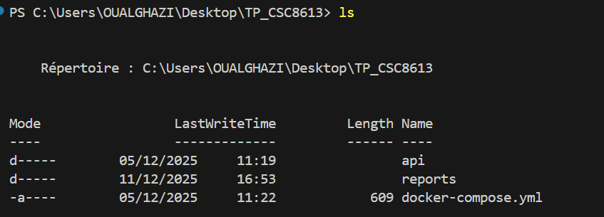
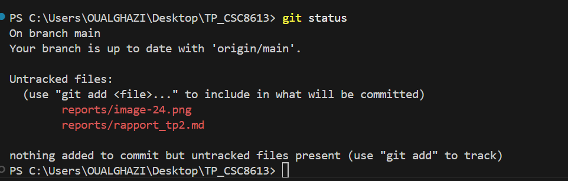
#### Question 1.b:
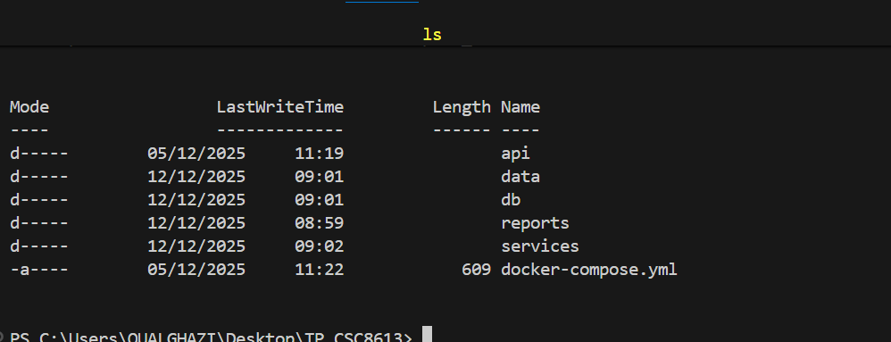
#### Question 1.c:
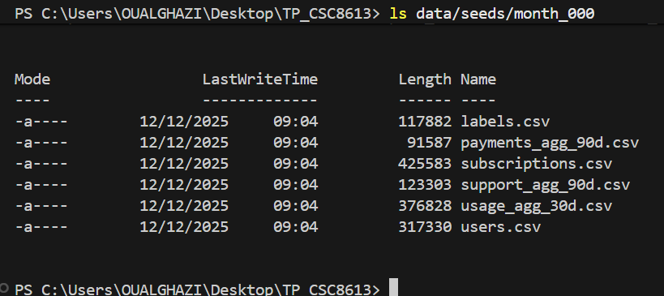
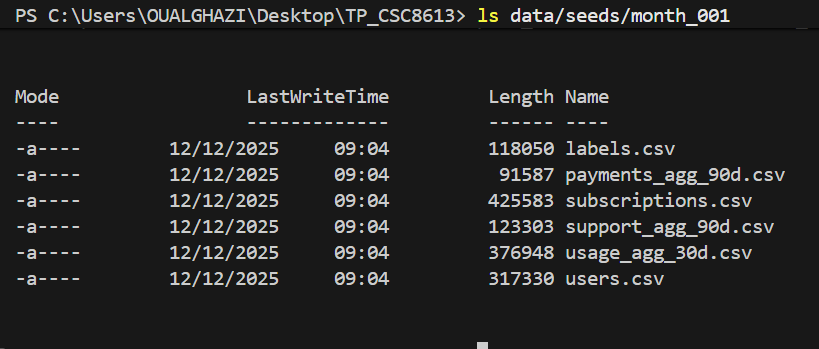
### Exercice 2 :
#### Question 2.a:
Le fichier `db/init/001_schema.sql` a été créé et contient toutes les tables nécessaires au TP2.  
#### Question 2.b: Rôle du fichier `.env`

Le fichier `.env` permet de définir les variables d’environnement (identifiants PostgreSQL) sans les coder en dur dans `docker-compose.yml`.  
Ces variables sont injectées automatiquement dans les conteneurs Docker pour assurer une configuration centralisée et sécurisée.
#### Question 2.c:
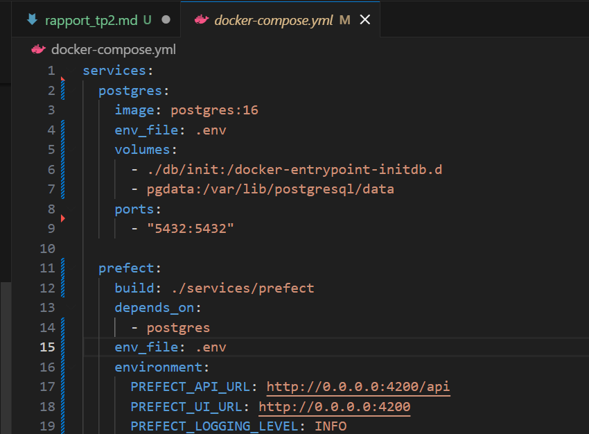
Le fichier `docker-compose.yml` a été modifié pour inclure les services `postgres` et `prefect`.  
Le service PostgreSQL utilise le fichier `.env` et exécute automatiquement les scripts présents dans `db/init/`.  
Le service Prefect réutilise les mêmes identifiants de connexion et montera les flux et les données nécessaires à l’ingestion.
#### Question 2.d:
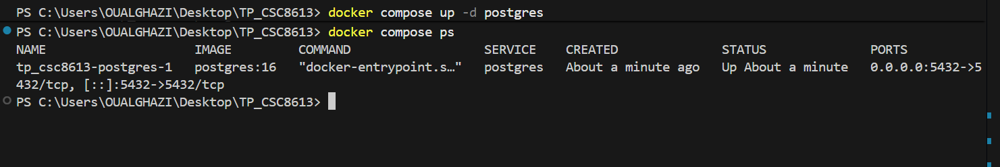
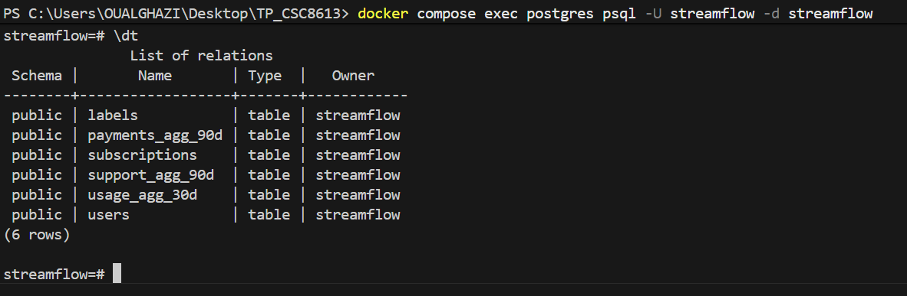
- **users** : informations de base sur les utilisateurs (profil, date d’inscription, caractéristiques).
- **subscriptions** : détails des abonnements (durée, type de contrat, options, facturation).
- **usage_agg_30d** : métriques d’usage des 30 derniers jours (temps de visionnage, appareils utilisés).
- **payments_agg_90d** : résumé des paiements des 90 derniers jours (paiements échoués).
- **support_agg_90d** : interactions avec le support client (nombre de tickets, temps moyen de résolution).
- **labels** : label de churn (0/1), utilisé plus tard en Machine Learning.
### Exercice 3:

#### Question 3.a:
**Rôle du conteneur Prefect**  
Le conteneur `prefect` joue le rôle d’**orchestrateur** du pipeline d’ingestion.  
Il exécute les flows Prefect qui lisent les fichiers CSV, les chargent dans PostgreSQL et, plus tard, appliqueront la validation (Great Expectations) et la prise de snapshots mensuels.
#### Question 3.b:
 **Logique de la fonction** `upsert_csv`
  
La fonction `upsert_csv` implémente une logique d’**upsert** (INSERT + UPDATE) à partir d’un fichier CSV :

1. Le CSV est chargé dans un DataFrame pandas, avec conversion de certains types (`signup_date` en date, colonnes booléennes en booléens).
2. Une table temporaire `tmp_<nom_de_table>` est créée dans PostgreSQL, puis les lignes du DataFrame y sont insérées.
3. Une requête `INSERT INTO ... SELECT ... FROM tmp ON CONFLICT (...) DO UPDATE` est construite :
   - la clause `ON CONFLICT` utilise les colonnes de clé primaire (`pk_cols`) ;
   - la partie `DO UPDATE SET` met à jour toutes les colonnes non clés avec leurs valeurs `EXCLUDED.col`.
4. La table temporaire est supprimée une fois l’upsert terminé.

Cette approche permet à la fois d’insérer les nouveaux enregistrements et de mettre à jour ceux qui existent déjà, sans dupliquer les lignes.

#### Question 3.c:

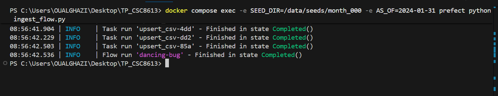

nous avons 7043 clients après month_000, d’après la table users.

### Exercice 4:
**Validation des données (Great Expectations)**

La fonction `validate_with_ge` ajoute une étape de contrôle qualité après l’ingestion.  
Pour chaque table, elle :

1. lit les données depuis PostgreSQL (jusqu’à 50 000 lignes) ;
2. convertit le DataFrame pandas en objet Great Expectations ;
3. applique un ensemble d’« expectations » (règles), par exemple :
   - vérifier que les colonnes correspondent au schéma attendu ;
   - vérifier que `user_id` n’est jamais nul ;
   - contrôler que certaines colonnes numériques sont toujours positives ou nulles ;
4. si au moins une de ces règles est violée, la validation renvoie `success = False` et la fonction lève une exception, ce qui fait échouer le flow d’ingestion.

Cela permet de détecter très tôt des anomalies dans les données (exports incomplets, colonnes manquantes, valeurs impossibles, etc.) avant d’enchaîner sur d’autres étapes comme la création de snapshots ou l’entraînement des modèles.

**Exemple d’expectations sur** `usage_agg_30d`

Exemples de règles ajoutées dans le code :

gdf.expect_table_columns_to_match_set([  
    "user_id",  
    "watch_hours_30d",  
    "avg_session_mins_7d",  
    "unique_devices_30d",  
    "skips_7d",  
    "rebuffer_events_7d",  
])  

gdf.expect_column_values_to_be_between("watch_hours_30d", min_value=0)  
gdf.expect_column_values_to_be_between("avg_session_mins_7d", min_value=0)  
gdf.expect_column_values_to_be_between("unique_devices_30d", min_value=0)  
gdf.expect_column_values_to_be_between("skips_7d", min_value=0)  
gdf.expect_column_values_to_be_between("rebuffer_events_7d", min_value=0)   

Ces bornes ont été choisies car les métriques d’usage sont des quantités physiques ou des compteurs :
- `watch_hours_30d` (heures de visionnage) ne peut pas être négatif ;
- `avg_session_mins_7d` (durée moyenne de session) ne peut pas être négative ;
- `unique_devices_30d`, `skips_7d`, `rebuffer_events_7d` sont des compteurs, donc doivent être ≥ 0.

##### Comment ces règles protègent le modèle?

Ces validations protègent le futur modèle en :
- détectant des valeurs impossibles (ex : temps de visionnage négatif) ;
- repérant rapidement des exports corrompus ou mal générés (colonnes manquantes, mauvais format, valeurs aberrantes) ;
- garantissant que les features utilisées pour l’entraînement/prédiction restent cohérentes, ce qui évite de dégrader les performances du modèle ou d’introduire des biais.

### Exercice 5:
#### Question 5.a:
`snapshot_month(as_of)` crée (si besoin) des tables de snapshots `*_snapshots` et y copie l’état des tables “live” en ajoutant une colonne `as_of` (date de fin de mois).  
Le champ `as_of` permet de conserver une version temporelle des données (une ligne par `user_id` et par mois), afin de figer l’état exact des features à une date donnée.

#### Question 5.b:
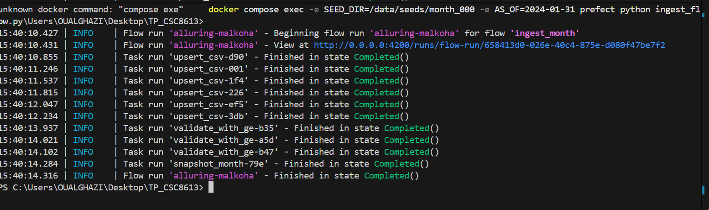

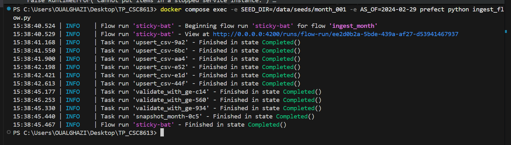

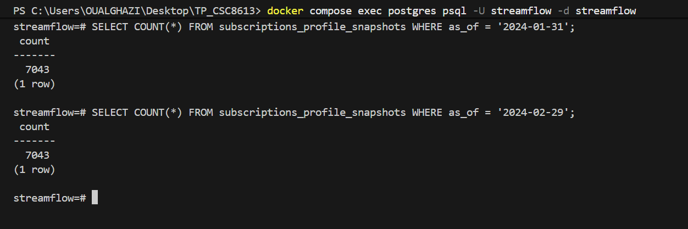

#### Question 5.c:
##### Synthèse du pipeline

CSV month_XXX (users, subscriptions, usage, payments, support, labels)  
|  
v  
[Prefect Flow]  
|  
+--> Upsert into tables live (users, subscriptions, ...)  
|  
+--> Great Expectations validation (users, subscriptions, usage_agg_30d)  
|  
+--> Snapshot stamping (tables *_snapshots with as_of)  
|  
v  
PostgreSQL (live tables + snapshots)  

##### Pourquoi ne pas entraîner directement sur les tables live ?

Les tables live évoluent en permanence (upserts mensuels, corrections, nouvelles données).  
En entraînant un modèle directement dessus, on risque de mélanger des états de données de dates différentes, ce qui rend l’entraînement non reproductible et peut introduire des incohérences temporelles.

##### Pourquoi les snapshots sont importants (data leakage + reproductibilité)

Les snapshots figent les données à une date `as_of` donnée.  
Cela permet :
- d’éviter la **data leakage** : on s’assure que les features utilisées pour un mois ne contiennent pas d’information provenant du futur ;
- de garantir la **reproductibilité temporelle** : on peut réentraîner un modèle sur exactement les mêmes données qu’à un instant passé.

##### Réflexion personnelle

Le plus difficile a été de stabiliser l’exécution du flow Prefect dans l’environnement Docker, notamment la connexion à l’API Prefect (erreur “Failed to reach API”).  
J’ai corrigé cela en redemarrant a chaque fois docker compose.
