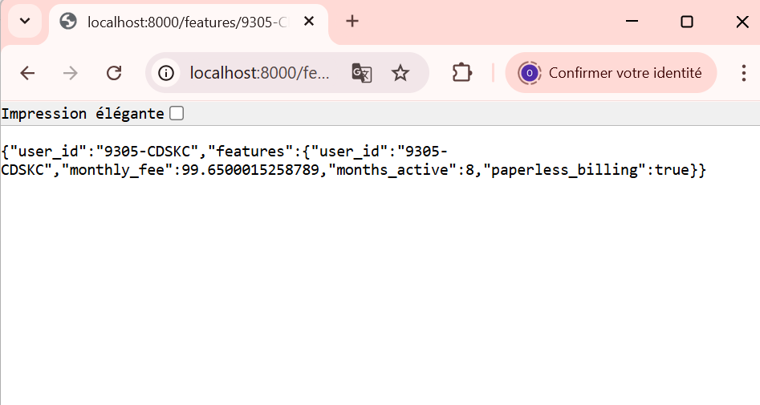

# Contexte

Nous disposons déjà d’une base PostgreSQL contenant des tables(users, subscriptions, usage, payments, support, labels) et des tables de snapshots temporels `*_snapshots` pour deux dates (fin janvier 2024 et fin février 2024). Ces snapshots figent l’état des données à chaque fin de mois.

L’objectif du TP3 est de brancher ces données au Feature Store Feast afin de définir des entités et des features, puis de récupérer des features en mode **offline** (pour l’entraînement) et **online** (pour la prédiction). Enfin, nous exposerons un endpoint API simple qui interroge Feast pour fournir des features à la demande dans le projet StreamFlow.

# Mise en place de Feast

Commande utilisée pour construire et démarrer les services :

```bash
docker compose up -d --build

```

**Le conteneur feast** sert à exécuter Feast dans l’environnement Docker.
La configuration du Feature Store se trouve dans /repo/feature_store.yaml à l’intérieur du conteneur (montée depuis ./services/feast_repo/repo).
Nous l’utiliserons via docker compose exec feast ... pour lancer notamment feast apply (création du registre) et feast materialize (chargement des features dans l’online store).
# Définition du Feature Store
Une Entity dans Feast représente un objet métier pour lequel on définit des features, et sert de clé de jointure entre les données sources et les features.

Dans StreamFlow, l’entité `user` est naturellement identifiée par `user_id`, car toutes les tables métier (abonnements, usage, paiements, support, labels) sont indexées par cet identifiant. Cela en fait une clé de jointure stable et cohérente pour agréger les features utilisateur.

Exemple de table snapshot : `usage_agg_30d_snapshots`

Elle contient notamment les features suivantes :
- watch_hours_30d
- avg_session_mins_7d
- unique_devices_30d
- rebuffer_events_7d

La commande `feast apply` valide la configuration du Feature Store, enregistre les entités, data sources et feature views dans le registre Feast, et prépare l’infrastructure nécessaire à l’utilisation offline et online des features.


Feast garantit la cohérence temporelle grâce au champ `timestamp_field = "as_of"` dans les DataSources et à l’utilisation de `event_timestamp` dans l’entity_df.  
Lors de `get_historical_features`, Feast sélectionne uniquement les valeurs de features disponibles avant ou à la date de l’événement, évitant toute fuite d’information du futur (point-in-time correctness).  


# Récupération offline & online
#### Dictionnaire retourné par get_online_features :


Si on interroge un `user_id` sans features matérialisées (utilisateur inexistant ou hors fenêtre de matérialisation), Feast renvoie des valeurs `None`/vides pour les features (car aucune valeur n’est présente dans l’online store), ce qui indique qu’aucune feature n’est disponible pour produire une prédiction.


Voici la réponse renvoyée par l’endpoint /features/{user_id} pour l’utilisateur 9305-CDSKC :





# Réflexion

L’endpoint `/features/{user_id}` réduit le training-serving skew car il utilise Feast comme source unique de vérité pour les features.  
Les mêmes FeatureViews, DataSources et règles temporelles servent à générer les features offline (entraînement) et online (serving).  
On évite ainsi d’avoir deux pipelines différents (un pour le training, un pour la prod) qui pourraient produire des features incohérentes.
