# TP4:Entraînement end-to-end : MLflow Registry → API de prédiction<

## OUALGHAZI Mohamed

### Exercice 1:

#### Commandes utilisées

docker compose up -d --build  
docker compose ps  
docker compose down  
docker compose up -d --build  
curl http://localhost:5000  
curl http://localhost:8000/health  
curl http://localhost:8000/features/9305-CDSKC  

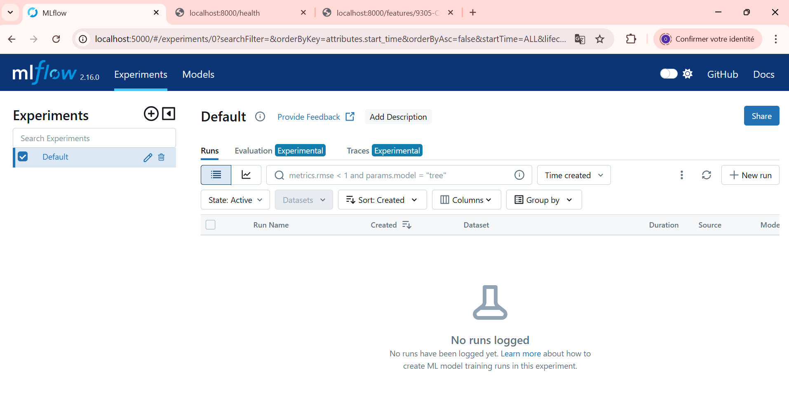

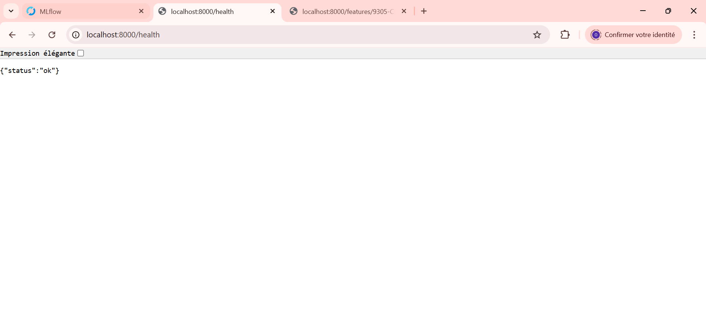

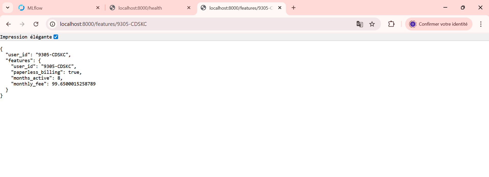

**Quels composants tournent et pourquoi ?**

 

* PostgreSQL : stockage des tables + snapshots, et aussi offline/online store Feast.

* Feast : définition des features (FeatureViews) + accès offline/online ; matérialisation vers l’online store.

* API FastAPI : /health, /features/{user_id}.

* MLflow : tracking des entraînements (paramètres, métriques, artefacts) et Model Registry pour promouvoir un modèle en Production.

### Exercice 2:
AS_OF utilisé : 2024-01-31

nombre de lignes après merge : 7043

cat_cols : ['net_service']

métriques : AUC= 0.61, F1= 0.05, ACC + temps d’entraînement: 1.05

Fixer `AS_OF` permet de figer la “date de référence” des features : on entraîne toujours sur le même état historique (snapshots) et on évite de mélanger des données futures, ce qui garantit la reproductibilité et limite le data leakage. Cela rend aussi possible la comparaison équitable entre plusieurs runs.  

Fixer `random_state` assure que les opérations aléatoires (split train/val, tirage des arbres du RandomForest, etc.) produisent les mêmes résultats à données identiques. Dans un pipeline MLOps orienté reproductibilité, cela permet de rejouer l’entraînement, d’expliquer les écarts de performance uniquement par des changements contrôlés (features, code, hyperparamètres) et de tracer précisément l’évolution du modèle dans MLflow.

On enregistre `pipe` (et non `clf`) car la pipeline contient le préprocessing (OneHotEncoder + sélection des colonnes) indispensable pour reproduire exactement la transformation des features au serving. Enregistrer seulement `clf` casserait la prédiction en production dès qu’il y a des variables catégorielles.

### Exercice 3:

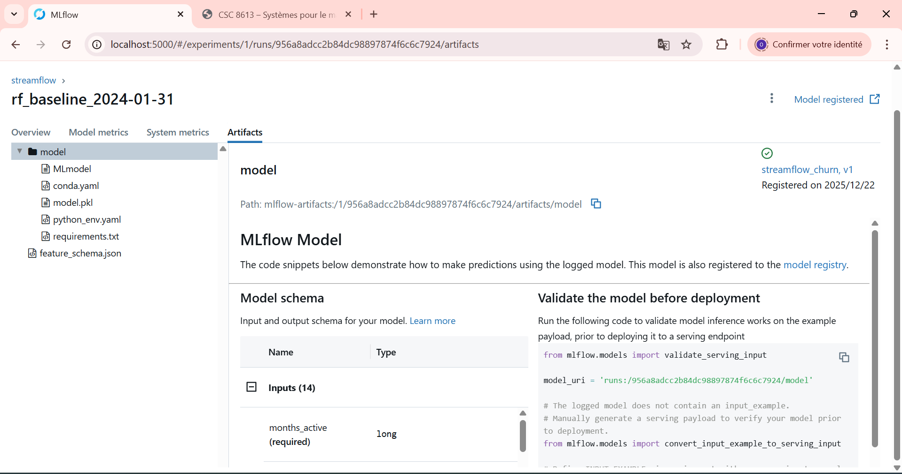

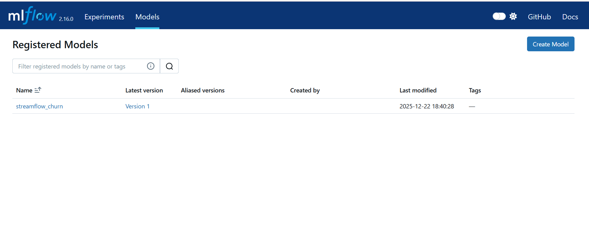

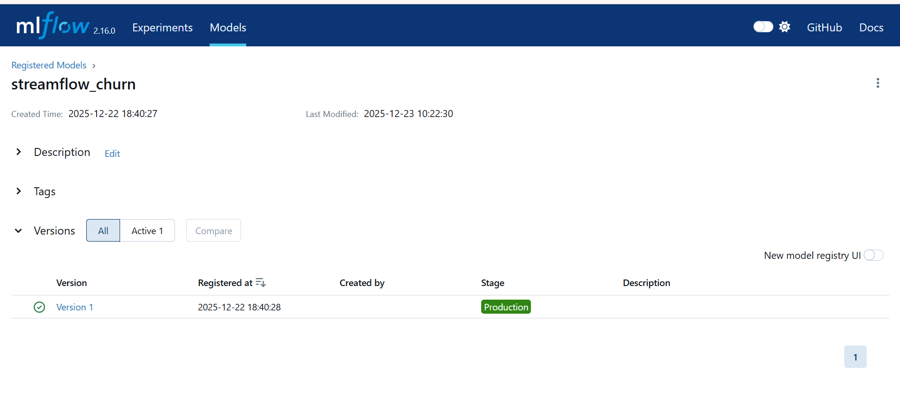

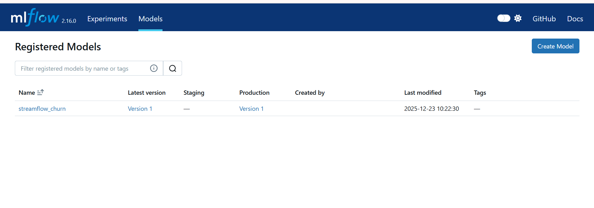

La promotion via le Model Registry (stages None → Staging → Production) est préférable à un déploiement manuel car elle centralise le cycle de vie du modèle et évite les erreurs de chemins locaux ou de fichiers copiés à la main.  
Chaque version est traçable (run MLflow associé, paramètres, métriques, artefacts), ce qui garantit auditabilité et reproductibilité.  
Le stage “Production” devient une référence unique : l’API ou les services n’ont pas besoin de connaître un chemin de fichier, ils chargent simplement “la version Production”.  
Cela permet aussi un contrôle plus sûr (validation en Staging avant Production, rollback rapide vers une version précédente).  
La promotion est collaborative : l’équipe partage le même registre et peut documenter les transitions sans dépendre de manipulations locales.

### Exercice 4:

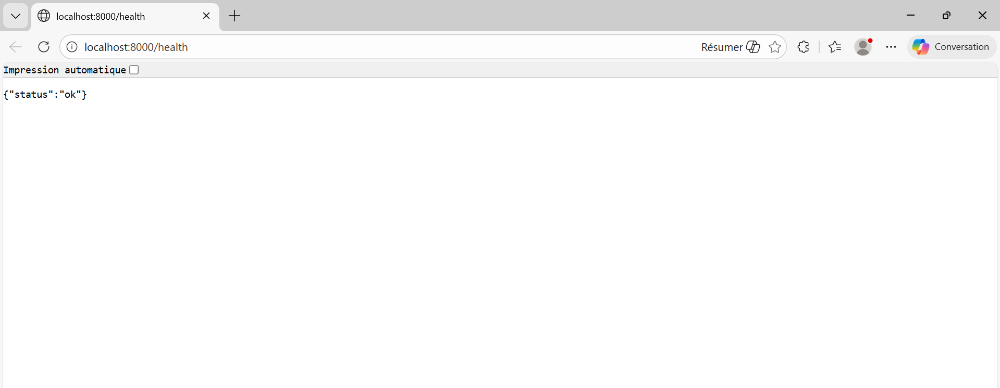

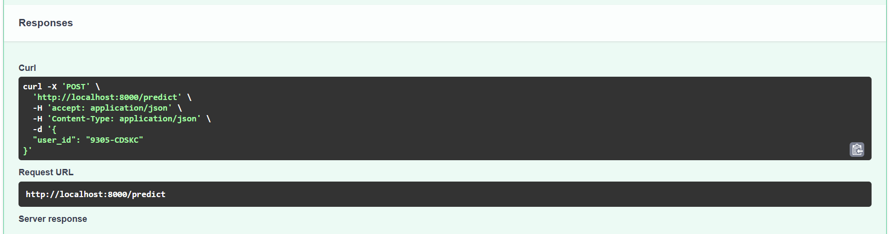

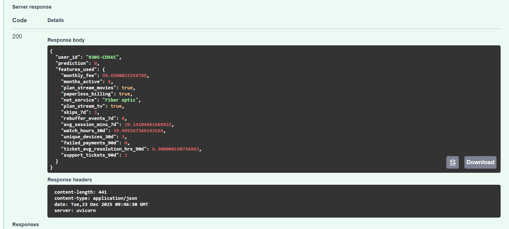

Le endpoint /predict renvoie une prédiction 0 pour l’utilisateur 9305-CDSKC, en utilisant des features récupérées depuis le online store Feast.

Charger le modèle via `models:/streamflow_churn/Production` garantit que l’API utilise toujours la version officiellement promue en Production dans le Model Registry, plutôt qu’un fichier local potentiellement différent.  
Le Registry centralise les versions, l’historique, et le lien avec le run MLflow (paramètres, métriques, artefacts), ce qui améliore la traçabilité et l’auditabilité.  
Cela permet aussi de faire des promotions/rollbacks sans redéployer manuellement des fichiers dans l’API.  
Un `.pkl` local ou un artefact de run dépend d’un chemin et d’un contexte machine, donc fragile et peu reproductible.  
Avec le stage Production, on a une “source de vérité” unique pour le serving, et on évite les erreurs de version (mauvais modèle chargé).

### Exercice 5:
**Test "succès"**
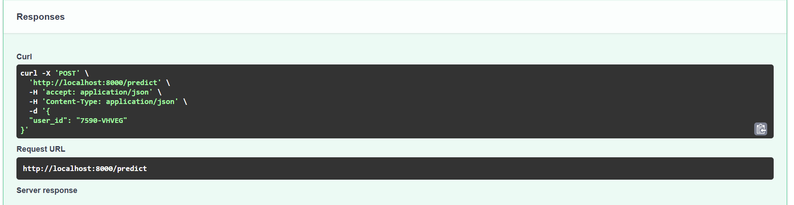

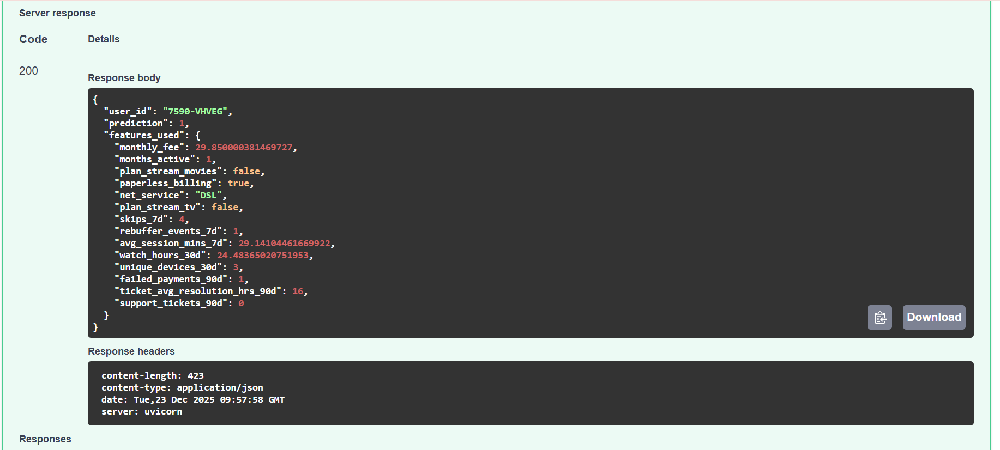

**Test “échec”**
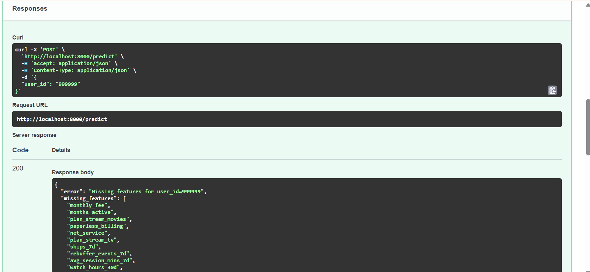

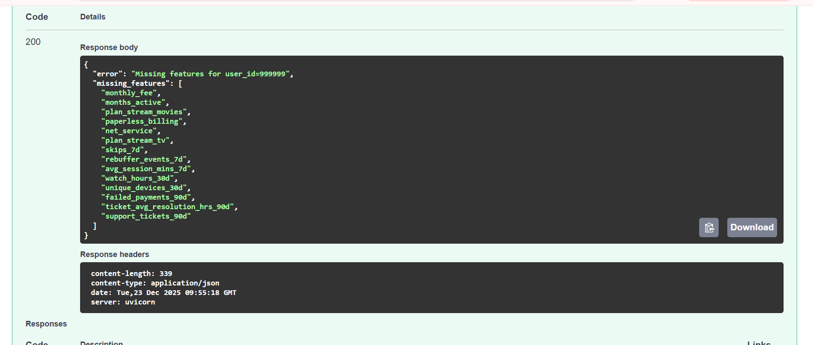

En serving, beaucoup d’échecs viennent des features plutôt que du modèle.  
**Entité absente :** si le `user_id` demandé n’existe pas dans l’online store, la récupération de features renvoie des valeurs manquantes (None/NaN) ou vides. Dans ce cas, l’API doit refuser la prédiction et retourner une erreur explicite (ex. `missing_features`) au lieu de produire une réponse arbitraire.  
**Online store incomplet / obsolète :** si la matérialisation Feast n’a pas été exécutée, ou si elle est “stale” (pas à jour), certaines colonnes peuvent être nulles alors que l’utilisateur existe. Cela se détecte tôt en vérifiant la présence de valeurs non nulles avant d’appeler le modèle, ce qui évite de servir des prédictions basées sur des données incomplètes ou incohérentes.

### Exercice 6:
**Rôle de MLflow dans la pipeline**

MLflow garantit la traçabilité des entraînements en enregistrant pour chaque run les paramètres (AS_OF, type de modèle, hyperparamètres), les métriques (AUC, F1, accuracy), les artefacts (pipeline, schéma des features) et le code exécuté. Cela permet de comprendre précisément comment un modèle a été entraîné et de comparer différentes versions.   
MLflow assure également une identification claire des modèles servis grâce au Model Registry, où chaque version est numérotée, historisée et associée à un run précis.  

**Signification du stage Production pour l’API**

Le stage Production désigne explicitement le modèle autorisé à être utilisé en serving. Au démarrage, l’API charge le modèle via models:/streamflow_churn/Production, sans dépendre d’un chemin local ou d’un run spécifique.  
Cela permet de changer de modèle en production sans redéployer l’API, simplement en modifiant le stage dans l’interface MLflow, et empêche le serving accidentel d’un modèle non validé.  

**Limites de la reproductibilité malgré MLflow**

Malgré MLflow, la reproductibilité peut encore casser à plusieurs endroits :

* les données peuvent changer (snapshots différents, labels modifiés, matérialisation Feast non identique) 

* le code peut évoluer sans être strictement versionné (feature engineering, préprocessing) 

* la configuration ou l’environnement (versions de librairies, paramètres Docker, variables d’environnement) peut différer entre deux exécutions.

Ces points montrent que MLflow est une brique centrale, mais qu’il doit être complété par une discipline stricte sur les données, le code et l’infrastructure.

