# TP5:Monitoring et observabilité

## OUALGHAZI Mohamed

### Exercice 1:

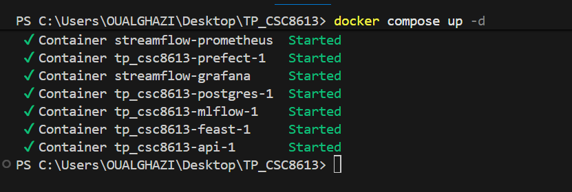

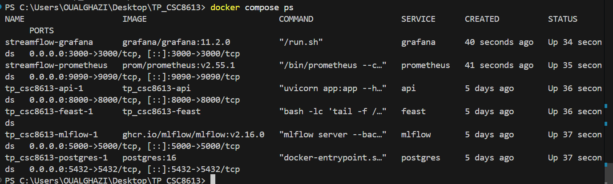

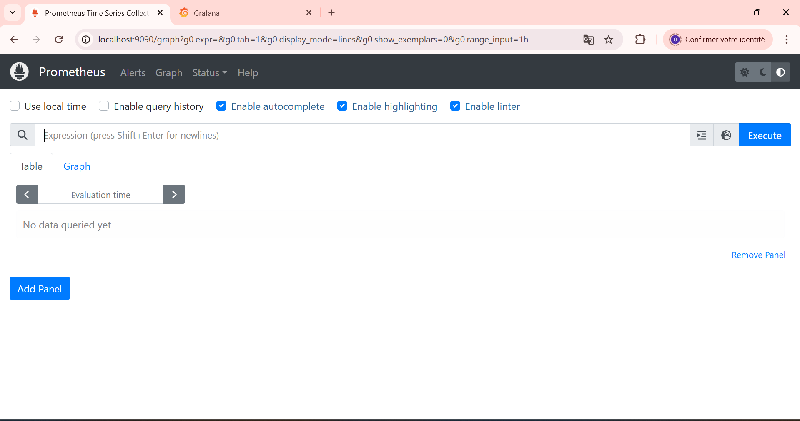

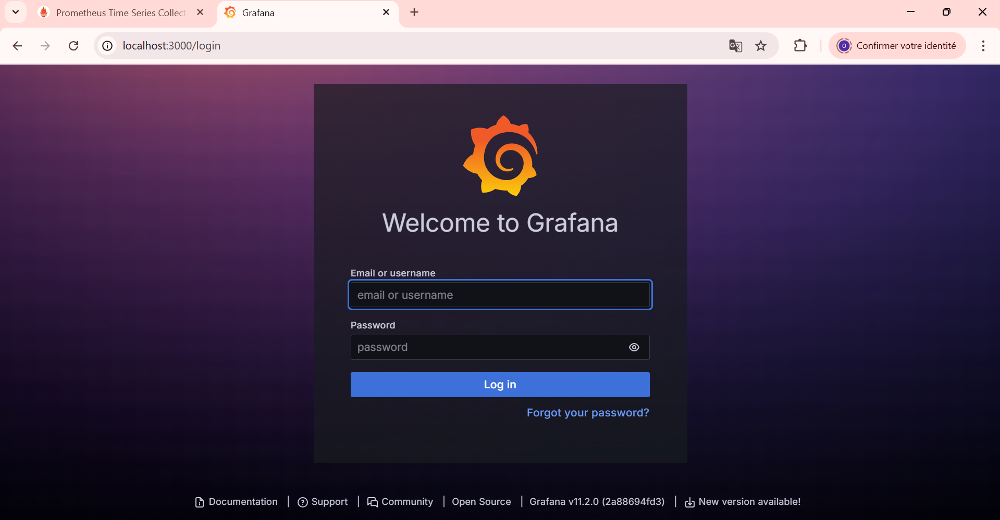

#### question 1.e:

Prometheus tourne dans un conteneur, donc localhost ferait référence au conteneur Prometheus lui-même, pas à la machine hôte. Il doit cibler le service Docker via le réseau compose, donc il utilise le nom DNS du service api : api:8000.

### Exercice 2:
Metrics avant predict :
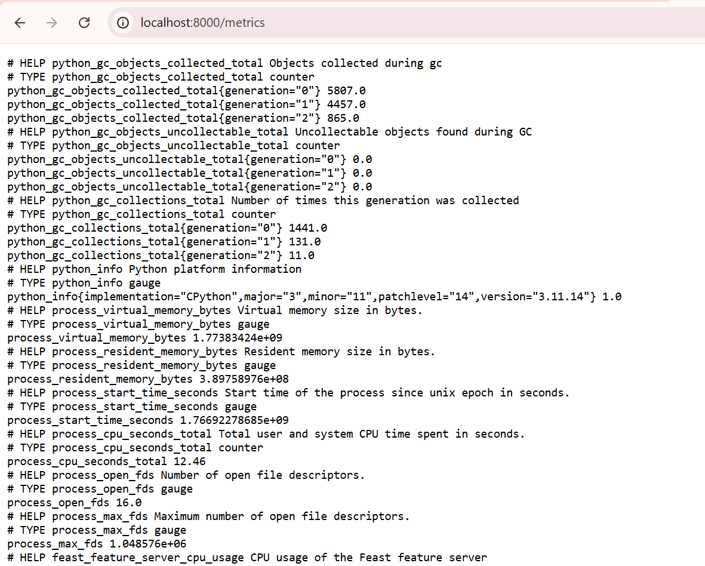
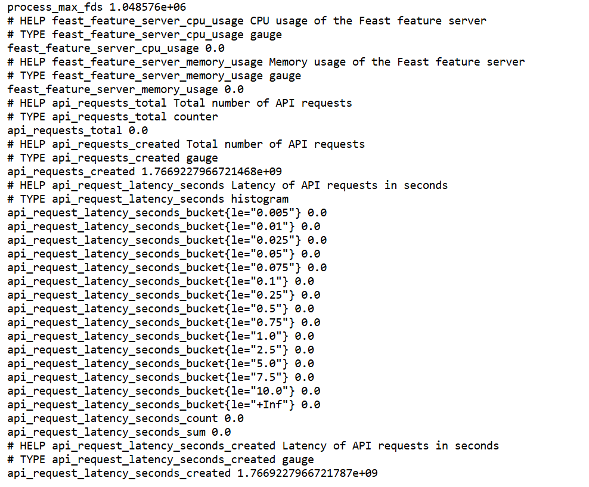
apres predict:
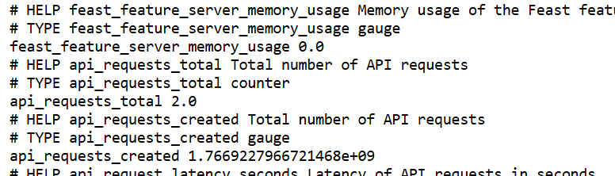    

Une moyenne de latence cache les extrêmes : une API peut avoir une moyenne “OK” mais des requêtes très lentes (p95/p99) qui dégradent l’expérience utilisateur.
Un histogramme permet de calculer des percentiles (p50/p95/p99) et de voir la distribution des latences.
C’est plus utile pour détecter des ralentissements intermittents, des timeouts, ou une dégradation progressive.

### Exercice 3:
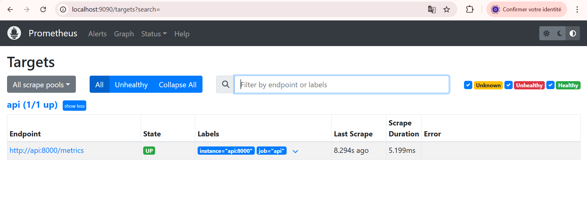

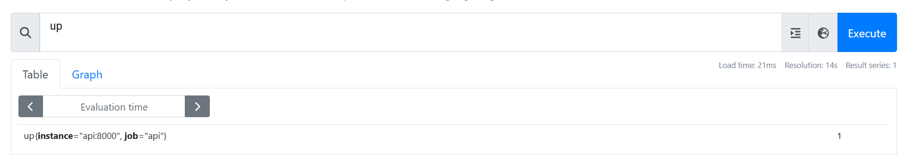

Interprétation  
up = 1 → la target est accessible  
up = 0 → Prometheus n’arrive pas à la joindre  

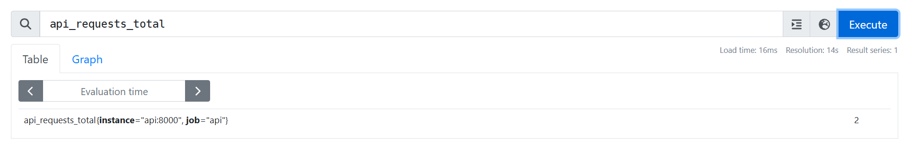
Interprétation

Compteur total des requêtes /predict  
La valeur augmente quand on appelle l’API (dans notre cas est 2 fois)  

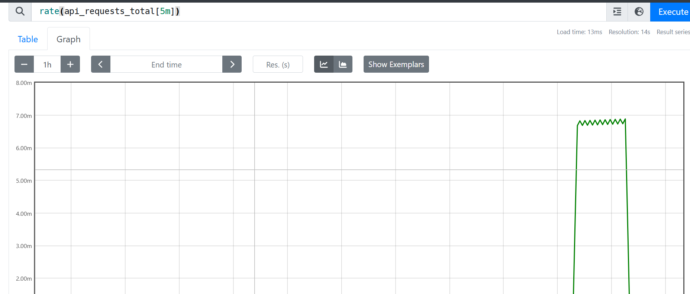
Nombre moyen de requêtes par seconde sur les 5 dernières minutes.   

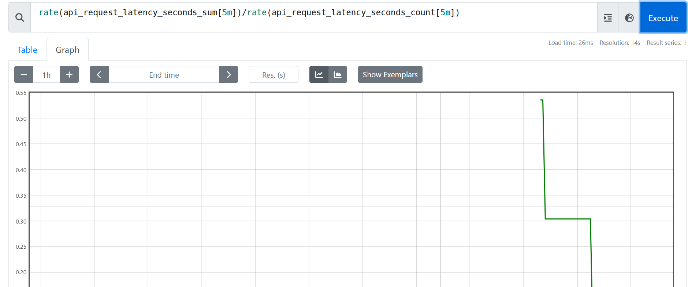

Cette valeur représente la latence moyenne des requêtes API (en secondes) sur les 5 dernières minutes.

### Exercice 4:

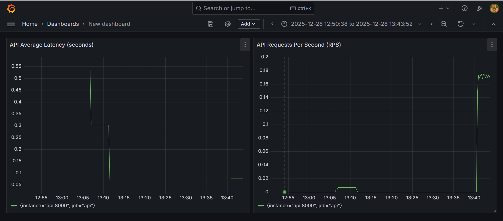

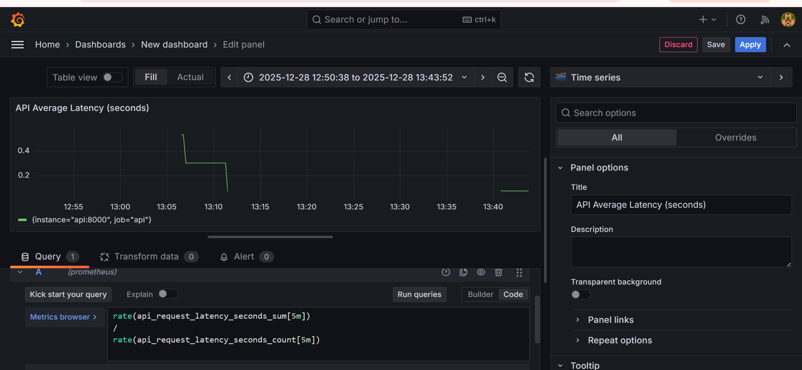

Les métriques exposées via Prometheus et visualisées dans Grafana permettent de détecter des problèmes liés au trafic et aux performances de l’API, comme une augmentation du nombre de requêtes ou une dégradation de la latence. Elles sont efficaces pour identifier des surcharges, des ralentissements ou des erreurs d’infrastructure.Mais ces métriques ne permettent pas de détecter une dégradation de la qualité du modèle (drift de données ou de prédictions), ni de savoir si les prédictions sont correctes du point de vue métier. Elles observent le système, pas la performance statistique du modèle.

### Exerccice 5:

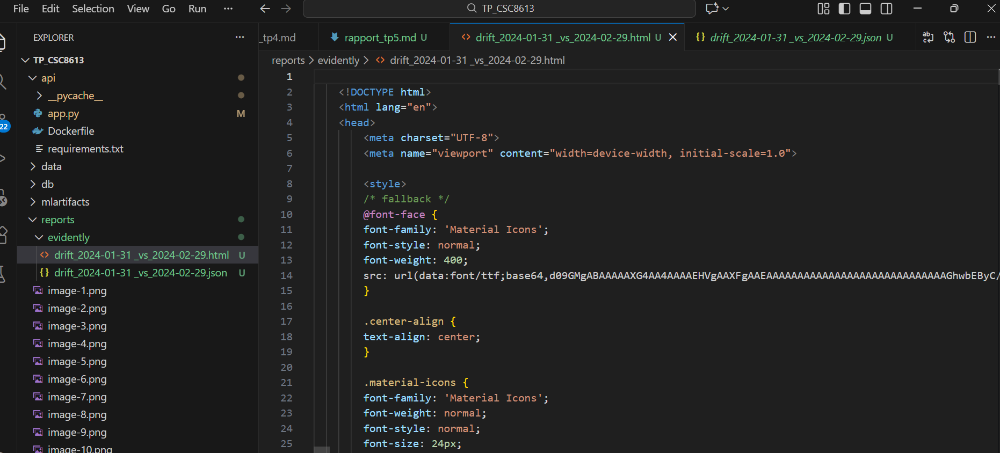
* Covariate drift : les distributions des features X changent entre month_000 et month_001 (ex: watch_hours_30d, monthly_fee…).

* Target drift : la distribution de la cible y change (ici la proportion de churn_label=1 entre les deux périodes).

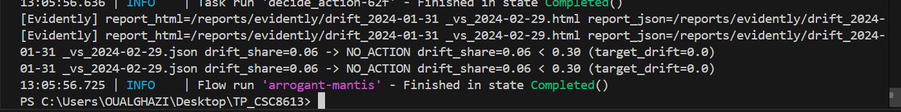
