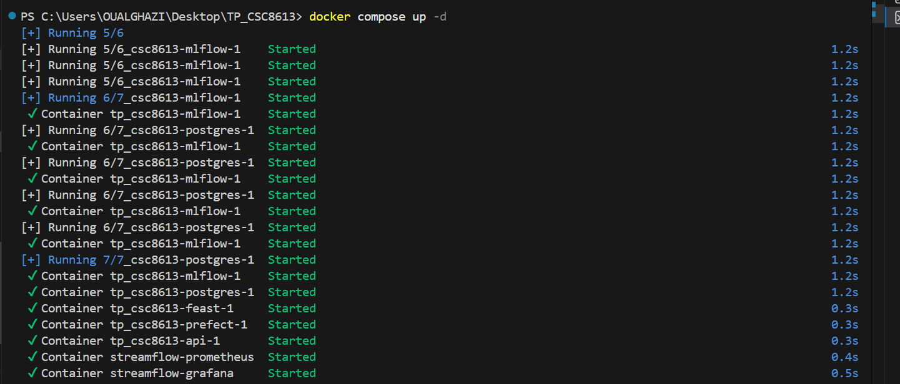
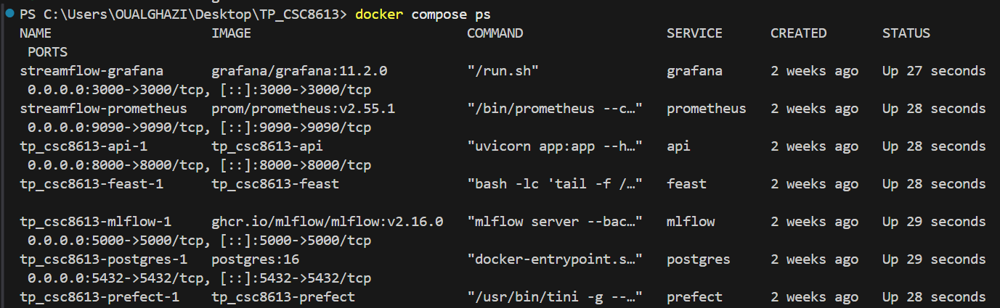
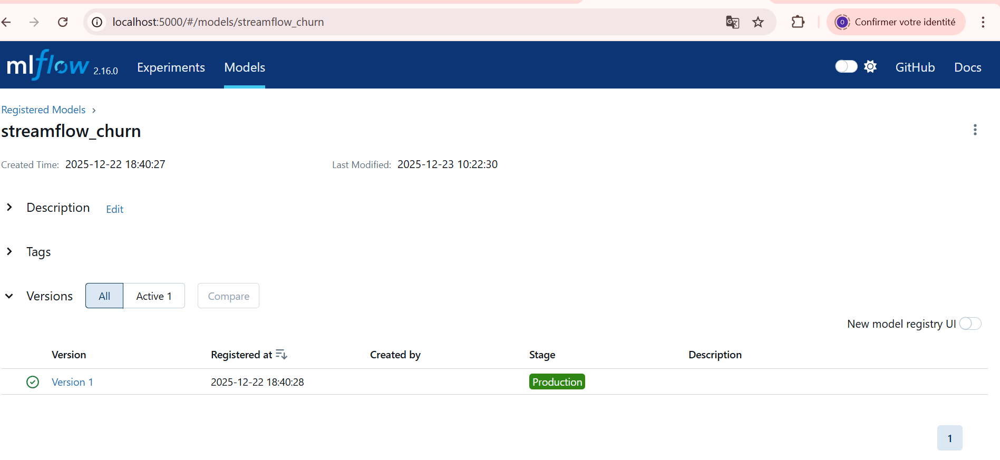
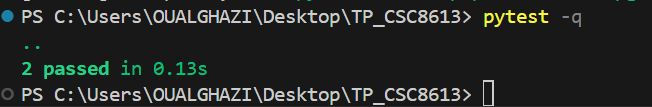
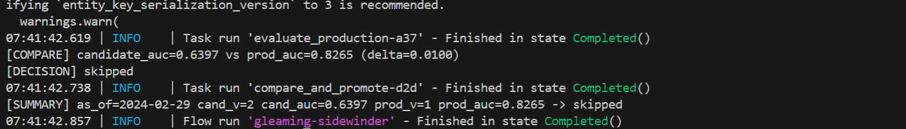
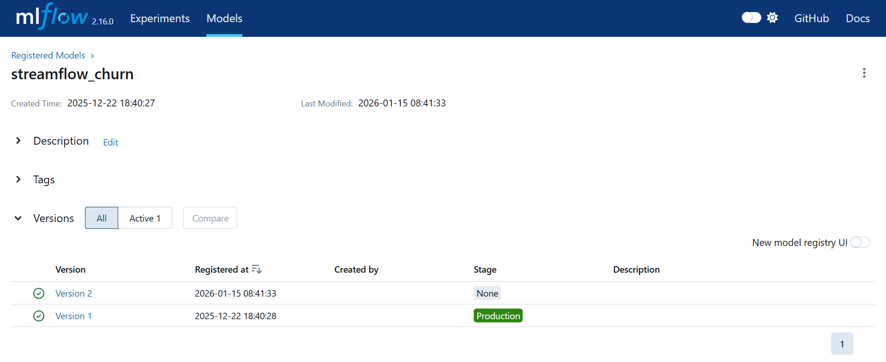
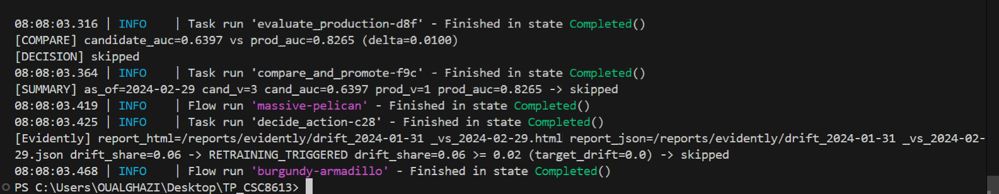
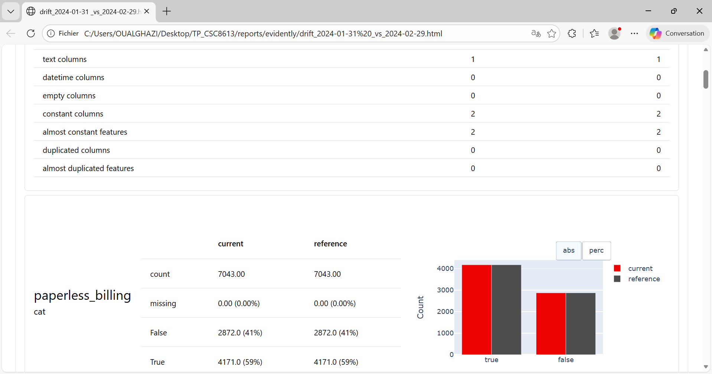
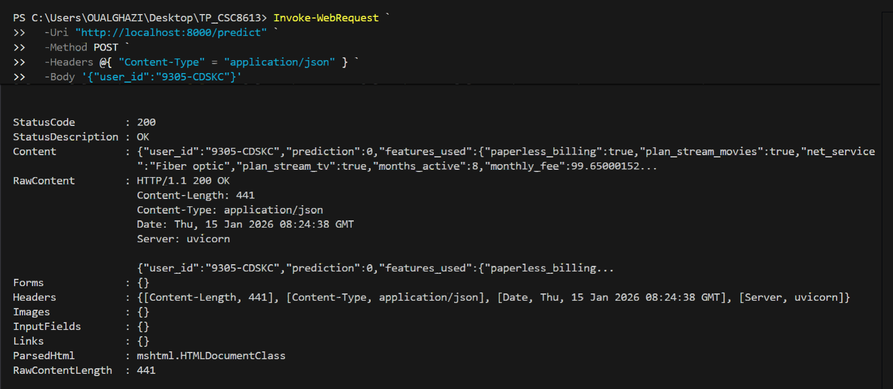

# TP6:CI/CD pour systèmes ML + réentraînement automatisé + promotion MLflow

## OUALGHAZI Mohamed

### Exercice 1:

### Exercice 2:

**Question 2.d:**  
On extrait une fonction “pure” (sans I/O, sans dépendance à Prefect/MLflow) pour pouvoir la tester rapidement et de manière déterministe, sans avoir à démarrer la stack Docker ni dépendre d’un état externe (registry, réseau, base de données).

### Exercice 3:

On utilise un delta pour éviter de promouvoir un modèle sur un gain insignifiant dû au hasard (split, bruit des données, variance de l’algorithme).
### Exercice 4:

### Exercice 5:

L’API doit être redémarrée car le modèle MLflow models:/streamflow_churn/Production est chargé au démarrage et mis en mémoire ; si une nouvelle version est promue en Production après coup, l’API ne la recharge pas automatiquement sans redémarrage.

### Exercice 6:
