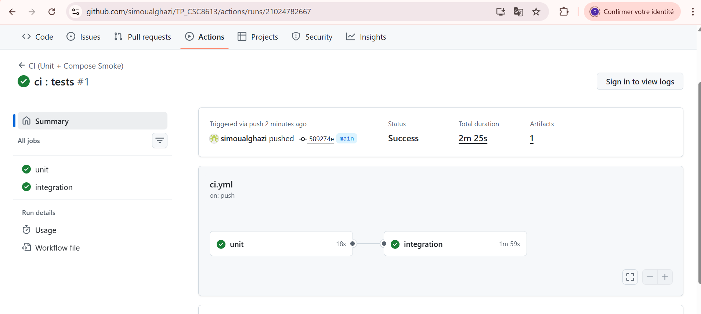

# TP6:CI/CD pour systèmes ML + réentraînement automatisé + promotion MLflow

## OUALGHAZI Mohamed

### Exercice 1:

### Exercice 2:

**Question 2.d:**  
On extrait une fonction “pure” (sans I/O, sans dépendance à Prefect/MLflow) pour pouvoir la tester rapidement et de manière déterministe, sans avoir à démarrer la stack Docker ni dépendre d’un état externe (registry, réseau, base de données).

### Exercice 3:

On utilise un delta pour éviter de promouvoir un modèle sur un gain insignifiant dû au hasard (split, bruit des données, variance de l’algorithme).
### Exercice 4:

### Exercice 5:

L’API doit être redémarrée car le modèle MLflow models:/streamflow_churn/Production est chargé au démarrage et mis en mémoire ; si une nouvelle version est promue en Production après coup, l’API ne la recharge pas automatiquement sans redémarrage.

### Exercice 6:
On démarre Docker Compose dans la CI pour exécuter un test d’intégration multi-services (API + dépendances comme Postgres/Feast/MLflow) et valider que la stack complète démarre correctement et que l’endpoint /health répond

### Exercice 7:
##### 1. Mesure du drift et rôle du seuil 0.02

Le **data drift** est identifié en comparant la distribution des données utilisées en production avec celle du jeu de données d’entraînement. Dans le pipeline, cette détection repose sur des **métriques statistiques** appliquées aux features numériques.

Le **seuil de 0.02 (2 %)** correspond à une tolérance minimale au changement. Lorsque le drift d’une feature critique dépasse cette valeur, cela indique une évolution significative des données justifiant le déclenchement d’un réentraînement.  
Dans un contexte réel, ce seuil est généralement plus élevé (entre **0.05 et 0.10**) afin d’éviter des réentraînements trop fréquents. Le choix du seuil dépend fortement du domaine applicatif : il peut être très strict en santé (≈ 0.01) et plus permissif dans des systèmes de recommandation (jusqu’à 0.15).

---

##### 2. Flow `train_and_compare_flow` : comparaison et promotion

Le flow **`train_and_compare_flow`**, orchestré par **Prefect**, implémente une logique de décision structurée :

1. **Chargement des données**  
   Les données de validation sont récupérées depuis PostgreSQL.

2. **Entraînement**  
   Un nouveau modèle est entraîné sur les données les plus récentes.

3. **Évaluation**  
   Les performances du modèle sont mesurées sur l’ensemble de validation à l’aide de la métrique principale **`val_auc`**.

4. **Comparaison**  
   La `val_auc` du nouveau modèle est comparée à celle du modèle actuellement en production (baseline).

5. **Décision de promotion**  
   - Si `new_auc > baseline_auc + threshold` → le modèle est promu (enregistré dans MLflow et poussé en staging/production).  
   - Sinon → le modèle est rejeté et la version en production est conservée.

6. **Traçabilité**  
   MLflow conserve l’historique complet du modèle, incluant métriques, paramètres et artefacts.

Cette approche qu’un modèle ne remplace la production **que s’il apporte un gain mesurable et contrôlé**.

---

##### 3. Rôle de Prefect vs GitHub Actions

| Composant        | Rôle |
|------------------|------|
| **Prefect**      | Orchestration métier et ML : détection du drift, entraînement, évaluation et promotion des modèles. Les flows peuvent être planifiés et se concentrent sur la performance des modèles. |
| **GitHub Actions** | CI/CD technique : exécution des tests unitaires, smoke tests, et validation de l’infrastructure. Les workflows sont déclenchés à chaque push ou Pull Request afin de garantir la qualité et la stabilité du code. |

En résumé, **Prefect décide quand et comment entraîner un modèle**, tandis que **GitHub Actions vérifie que le code est prêt à être déployé**.

---

##### 4. Architecture complète : Docker Compose en CI

Le lancement de **Docker Compose dans la CI** permet de réaliser un **test d’intégration multi-services**. Le workflow démarre les services `postgres`, `feast`, `mlflow` et `api` afin de vérifier que :

- l’API démarre correctement et répond aux endpoints de healthcheck ;
- les dépendances (PostgreSQL, MLflow, etc.) sont bien configurées et interconnectées ;
- les changements de code n’introduisent pas de régression au niveau de l’infrastructure.

Ce type de test permet de détecter précocement des erreurs qui ne seraient pas visibles avec des tests unitaires seuls.

---

## 5. Limites et pistes d’amélioration

### Pourquoi la CI ne doit pas entraîner le modèle complet
- **Temps d’exécution élevé** : un entraînement complet peut prendre plusieurs minutes, voire plus, ce qui ralentirait chaque Pull Request.  
- **Consommation de ressources** : les runners GitHub ne sont pas conçus pour des charges ML intensives.  
- **Dépendance aux données** : l’entraînement nécessite des jeux de données volumineux ou sensibles, rarement disponibles en CI.  
- **Non-déterminisme** : les résultats peuvent varier selon les données et les seeds, alors qu’une CI doit être reproductible.

La CI a pour rôle de **valider le code**, tandis que Prefect se charge de **valider la performance réelle des modèles**.

### Améliorations possibles
- Ajout de tests dédiés au calcul du drift et à la qualité des features  
- Tests de performance et de charge de l’API  
- Mise en place de mécanismes de rollback automatique  
- Intégration d’une **approbation humaine** avant promotion en production, nécessaire dans de nombreux contextes réglementés pour assurer la gouvernance et la conformité métier
